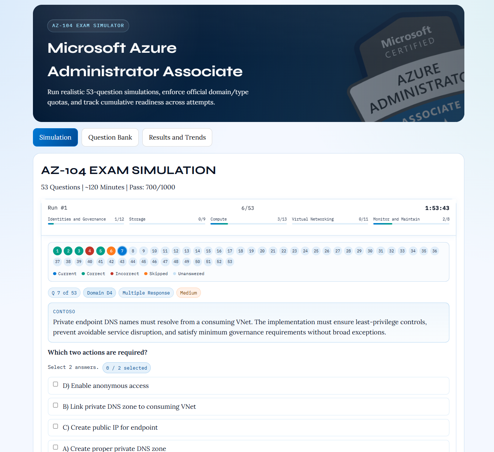

# AZ-104 Exam Simulator



A browser-based Azure Administrator (AZ-104) practice application featuring a strict 53-question exam engine that mirrors Microsoft's official distribution rules, local question-bank management, and cumulative trend tracking across multiple exam runs.

## Features

### Exam Engine
- **Exactly 53 questions per run** – matches official AZ-104 distribution
- **Fixed domain quotas** – D1=12, D2=9, D3=13, D4=11, D5=8
- **Type quotas** – Multiple Choice=28, Multi-Select=8, Yes/No=6, Case Study=5, Drag-and-Drop=4, Hot Area=2
- **Intelligent question shuffling** – tracks prior runs to avoid repeats when possible
- **One case study block per run** – linked 5-question block with scenario context

### Question Interactivity
- Per-question answer reveal with detailed rationale and reference links
- Hint system for guided learning without spoiling answers
- Skip and pause functionality during exam
- Timed and untimed run modes
- Answer key reveals after submission

### Analytics & Progress
- Detailed results reporting with score calculation
- Cumulative trend analysis across multiple attempts
- Run history with performance metrics by domain and question type
- Readiness assessment based on historical performance

### Question Bank Management
- Import custom question bank JSON
- Export current question bank
- Question validation and health checks
- Active/inactive question toggling
- Bundled starter bank from `public/data/az104-question-bank.json`

### Storage & Persistence
- Browser local storage for question bank state
- Run history tracking across browser sessions
- Presentation mode preferences

## Technology Stack

- **React** 19 with TypeScript
- **Vite** – fast development and optimized production builds
- **TypeScript** – type-safe codebase
- **ESLint** – code quality and consistency
- **Vitest** – unit test framework

## Quick Start

### Prerequisites
- Node.js 16+ and npm

### Installation & Development

1. Clone the repository and install dependencies:
```bash
git clone https://github.com/your-username/az-104-exam-simulator.git
cd az-104-exam-simulator
npm install
```

2. Start the development server (runs at `http://localhost:5173`):
```bash
npm run dev
```

3. Open your browser and the app will auto-reload on code changes.

### Building & Deployment

Build the production bundle:
```bash
npm run build
```

The optimized output is created in the `dist/` directory.

### Code Quality

Run linter to check for style issues:
```bash
npm run lint
```

Optional quality audit (tracks high/medium findings and answer-key distribution):
```bash
npm run audit:quality
```

Run tests:
```bash
npm run test
```

## Deploy To GitHub Pages

This repository includes an automated GitHub Actions workflow at `.github/workflows/deploy-pages.yml`.
It automatically builds and deploys the app to GitHub Pages on every push to `main`.

**Setup steps:**
1. Push this project to a GitHub repository.
2. In GitHub, open **Settings → Pages**.
3. Set **Source** to **GitHub Actions**.
4. Push to `main` (or manually trigger the workflow from the **Actions** tab).

The workflow automatically sets the Vite base path:
- `/<repo-name>/` for project pages (e.g., `https://<user>.github.io/az-104-exam-simulator/`)
- `/` for user/organization pages repos named `<user>.github.io`

After deployment completes, the published URL appears in the workflow run summary.

## Project Structure

```
src/
├── components/          # React UI components
│   ├── SimulationRunner.tsx    # Main exam runtime interface
│   ├── QuestionRenderer.tsx    # Question display logic
│   ├── AnswerReveal.tsx        # Answer and rationale display
│   ├── ResultsReport.tsx       # Results and analytics
│   ├── QuestionBankAdmin.tsx   # Question bank management UI
│   ├── CaseStudyPanel.tsx      # Case study context display
│   ├── CumulativeAssessment.tsx # Progress tracking
│   └── ...
├── services/            # Business logic and utilities
│   ├── examGenerator.ts        # 53-question run engine
│   ├── questionBankService.ts  # Bank validation and import/export
│   ├── scoringService.ts       # Score calculation
│   ├── evaluationService.ts    # Answer evaluation
│   ├── optionShuffleService.ts # Answer randomization
│   ├── historyService.ts       # Run history management
│   └── storage.ts              # Browser storage abstraction
├── types/               # TypeScript type definitions
│   ├── exam.ts                 # Question, domain, and type definitions
│   └── results.ts              # Result and analytics types
├── config/              # Configuration
│   └── examBlueprint.ts # Domain and type quotas
├── App.tsx              # Main application component
├── main.tsx             # Entry point
├── index.css            # Global styles
└── App.css              # App-specific styles

public/data/
└── az104-question-bank.json    # Bundled starter question bank

```

## Exam Rules & Distribution

The simulator enforces Microsoft's official AZ-104 distribution constraints:

### Domain Breakdown (5 domains, 53 total)
- **Domain 1** (Manage Azure Identities & Governance): 12 questions
- **Domain 2** (Implement & Manage Storage): 9 questions
- **Domain 3** (Deploy & Manage Azure Compute): 13 questions
- **Domain 4** (Implement & Manage Virtual Networking): 11 questions
- **Domain 5** (Monitor & Maintain Azure Resources): 8 questions

### Question Type Distribution
- Multiple Choice: 28 questions
- Multi-Select: 8 questions
- Yes/No: 6 questions
- Case Study: 5 questions (linked scenario)
- Drag-and-Drop: 4 questions
- Hot Area (image hotspot): 2 questions

### Intelligent Run Generation
- Respects domain and type quotas strictly
- Tracks prior run history to avoid question repeats when possible
- Falls back to reruns only when unseen pool is exhausted
- Supports multiple consecutive no-repeat runs with the bundled JSON bank

## Question Bank

### Bundled Starter Bank

The simulator ships with a comprehensive starter bank:
- **Questions are loaded from** `public/data/az104-question-bank.json`
- **7 case studies** with 5 linked questions each
- Aligned to AZ-104 skills measured as of April 17, 2026
- Supports 6+ consecutive 53-question no-repeat exam runs

### Using the Question Bank

1. **Load the bundled bank** – Click the "Question Bank" tab and load the pre-configured starter bank
2. **Export current bank** – Export the active bank to JSON for backup or sharing
3. **Import custom bank** – Load a custom JSON file with your own questions
4. **Manage questions** – Toggle questions active/inactive, review syntax validation

### Question Bank File Format

The question bank is a JSON file with the following structure:

```json
{
  "version": "2026.05.12",
  "updatedAt": "2026-05-12T00:00:00.000Z",
  "questions": [
    {
      "id": "Q2001",
      "domain": "D1",
      "type": "multiple-choice",
      "difficulty": "medium",
      "subtopic": "Entra ID User Management",
      "scenario": "Your organization uses Azure AD for identity management...",
      "stem": "What should you do?",
      "correctOptionId": "A",
      "options": [
        { "id": "A", "text": "Create a new security group..." },
        { "id": "B", "text": "..." },
        { "id": "C", "text": "..." },
        { "id": "D", "text": "..." }
      ],
      "hint": "Consider the principle of least privilege when assigning roles...",
      "rationale": "Security groups in Entra ID are used to manage collective permissions...",
      "references": [
        { "title": "Microsoft Entra security groups", "url": "https://learn.microsoft.com/..." }
      ],
      "active": true
    }
  ],
  "caseStudies": [
    {
      "id": "CS1",
      "scenario": "Contoso Ltd has multiple Azure subscriptions...",
      "questionIds": ["Q2010", "Q2011", "Q2012", "Q2013", "Q2014"],
      "active": true
    }
  ]
}
```

### Question Types

| Type | Format | Count | Example |
|------|--------|-------|---------|
| **multiple-choice** | Single correct answer from 4 options | 28 | "Which resource can be shared across subscriptions?" |
| **multi-select** | Multiple correct answers (2-4), select N | 8 | "Select all valid options that..." |
| **yes-no** | True/False question | 6 | "Is this statement correct?" |
| **case-study** | Linked to case study context | 5 | Scenario-based questions |
| **drag-and-drop** | Reorder items into categories | 4 | "Match items to their correct categories" |
| **hot-area** | Image hotspot selection | 2 | "Click the area that..." |

### Question Object Schema

All questions must include:
- `id` – Unique identifier (e.g., "Q2001")
- `domain` – One of: D1, D2, D3, D4, D5
- `type` – One of the question types listed above
- `difficulty` – easy, medium, hard
- `subtopic` – Topic area (e.g., "Entra ID User Management")
- `scenario` – Context/background (required for multi-select, case-study, drag-and-drop, hot-area)
- `stem` – The question text
- `correctOptionId` (multiple-choice, yes-no) or `correctOptionIds` (multi-select) – Answer key(s)
- `options` – Array of option objects with `id` and `text`
- `hint` – Guidance text without spoiling the answer
- `rationale` – Explanation of the correct answer
- `references` – Array of Microsoft Learn links with `title` and `url`
- `active` – Boolean (true to include in runs, false to exclude)

### Creating Questions

Best practices when adding questions:
- Base questions on official Microsoft Learn documentation
- Ensure answers align with Azure administrator responsibilities
- Write clear, concise scenario text
- Provide helpful hints that guide without revealing answers
- Include 2-4 reference links to authoritative sources
- Validate answer options match the official answer key
- Test questions by running the simulator and verifying distribution

## Contributing

We welcome contributions to improve the AZ-104 Exam Simulator! The most valuable contributions are new, high-quality questions for the question bank.

### How to Contribute Questions

**Step 1: Prepare Your Questions**

1. Create a JSON file following the question bank format (see **Question Bank File Format** above)
2. Validate your JSON syntax before submitting
3. Ensure all questions are:
   - Technically accurate based on Microsoft Learn
   - Properly distributed across domains (D1-D5)
   - Balanced in difficulty (easy/medium/hard)
   - Include helpful hints and detailed rationales
   - Include 2+ reference links to official documentation

**Step 2: Fork & Create a Branch**

```bash
# Fork the repository on GitHub

git clone https://github.com/YOUR-USERNAME/az-104-exam-simulator.git
cd az-104-exam-simulator
git checkout -b add-questions-Q2501-Q2525
```

**Step 3: Add Your Questions**

1. Add your question bank JSON to the [public/data/](public/data/) directory
2. Prefer editing [public/data/az104-question-bank.json](public/data/az104-question-bank.json) directly
3. Update the version timestamp in your JSON

**Step 4: Test Your Changes**

```bash
# Install dependencies
npm install

# Start dev server to test questions
npm run dev
```

- Load your question bank in the app
- Run multiple exam simulations to verify distribution
- Check that no validation errors appear
- Verify answers are correct

**Step 5: Submit a Pull Request**

1. Commit and push your changes:
```bash
git add .
git commit -m "Add 25 new questions (Q2501-Q2525) for D3 Compute topics"
git push origin add-questions-Q2501-Q2525
```

2. On GitHub, open a Pull Request with:
   - **Title**: Brief description (e.g., "Add 25 new D3 Compute questions")
   - **Description**:
     - Number of questions added
     - Domains covered
     - Topics/subtopics included
     - Any validation or testing performed

3. Our maintainers will review, validate, and merge your contribution!

### Contribution Guidelines

- **Quality first** – All questions must be technically accurate and well-researched
- **Follow the schema** – Ensure JSON structure matches the question bank format
- **Diverse coverage** – Distribute new questions across domains and difficulty levels
- **Clear writing** – Use professional language that matches Microsoft's style
- **Complete references** – Every question needs 2+ links to Microsoft Learn
- **No duplicates** – Avoid repeating existing questions; check the bundled bank first

### Reporting Issues

Found a bug or have a suggestion? Please open an issue on GitHub with:
- Clear description of the problem
- Steps to reproduce (if applicable)
- Expected vs. actual behavior
- Browser and OS details

## Storage

All user data is stored locally in the browser:
- **Question bank** – Local storage (survives browser restart)
- **Run history** – Local storage (cumulative across sessions)
- **Preferences** – Presentation mode and display settings

*No data is sent to external servers. All processing happens in your browser.*

## Scoring Notes

- Scores are calculated as a percentage correct out of 53 questions
- Scaled score is an estimated curve for training realism
- Official Microsoft scoring uses a proprietary algorithm
- Historical scores are tracked for cumulative trend analysis

## License

This project is licensed under the MIT License — see [LICENSE](LICENSE) for details.

## Support & Feedback

- Have questions? Check the GitHub Issues tab
- Want to contribute? See the **Contributing** section above
- Found a bug? Please report it on GitHub Issues

---

**Happy studying! Good luck on your AZ-104 exam!** 🚀

